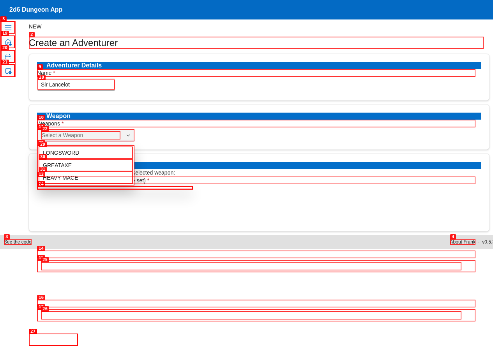
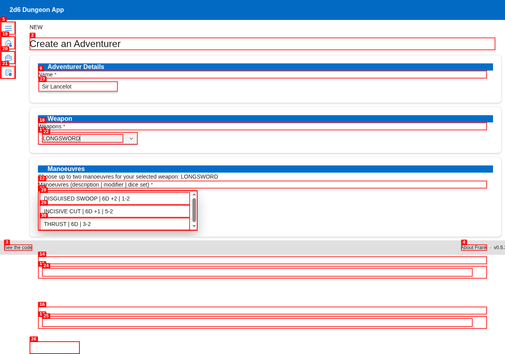
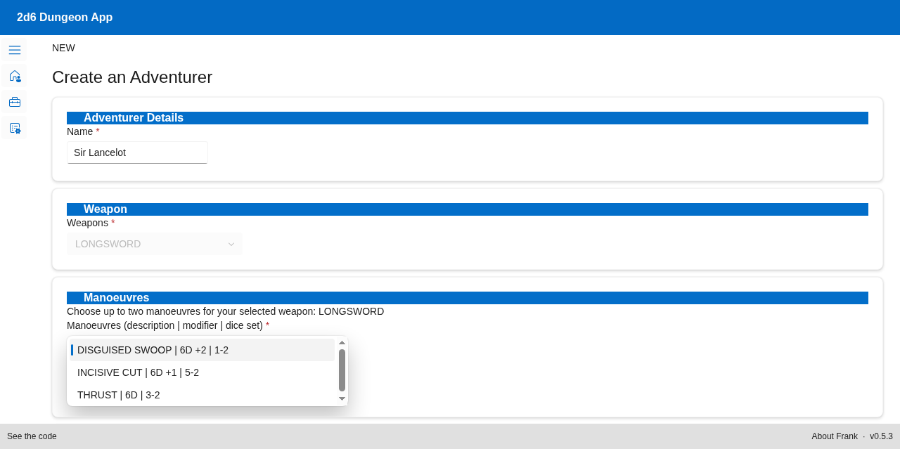

# Creating Your Adventurer 🛡️🗡️

A great quest requires a legendary hero! This guide walks you step-by-step through the process of creating and configuring your starting adventurer inside the **2D6 Dungeon App** companion.

---

## 🚪 Step 1: Navigating to Character Creation

1. From the **Home Screen**, click the blue **`+ Create a new adventure`** button.
2. On the **Adventure Initialization** screen, look for the "Select or Create an Adventurer" section.
3. Click the **`New`** button next to the adventurer data table.

This opens the **Create an Adventurer** wizard.

---

## ✍️ Step 2: Entering Adventurer Details

On the creation screen, enter the fundamental traits of your starting character:

1. **Name:** Enter your hero's name (e.g., `Sir Lancelot`).
2. **Weapon Selection:** Open the **Weapons** dropdown and choose your starting weapon. 
   - Available options include classic starting gear: `LONGSWORD`, `GREATAXE`, or `HEAVY MACE`.
   - **Crucial Rule:** Once you select a starting weapon, the field will automatically lock. The application calculates and filters the available combat moves (manoeuvres) matching that specific weapon!

---

## ⚔️ Step 3: Training Combat Manoeuvres

With your weapon selected, you are now prompted to choose up to **two combat manoeuvres** associated with that weapon. Manoeuvres represent tactical stances, strikes, or defensive postures you can use during combat.

* Each manoeuvre is listed with its **Name**, **Modifier** (e.g., `6D +2` or `6D +1`), and the required **Dice Set** (e.g., `1-2` or `5-2`).
* Select up to two to add them to your adventurer's active sheet.

---

## 🛡️ Step 4: Starting Gear & Magic

Scroll down to finish equipping your hero:

1. **Armour Piece (Optional):** Choose your starting protection. This dropdown lists available starting shields and body armour pieces (displaying Name | Modifier | Dice Set).
2. **Magic Scroll (Optional):** If your hero starts with spells or ancient knowledge, select a magic scroll from the scroll list (displaying Scroll Type | Description).

---

## 💾 Step 5: Save Your Hero!

Once you are satisfied with your character's layout, scroll to the very bottom of the page:

Click the green **`Save Adventurer`** button.

### What Happens Next?
* The application saves your adventurer's sheet directly to your local MySQL database.
* You are redirected back to the **Adventure Initialization** screen.
* Your newly created hero (e.g., *Sir Lancelot*) will now appear inside the Adventurers table, ready to be selected for your upcoming dungeon crawl!
