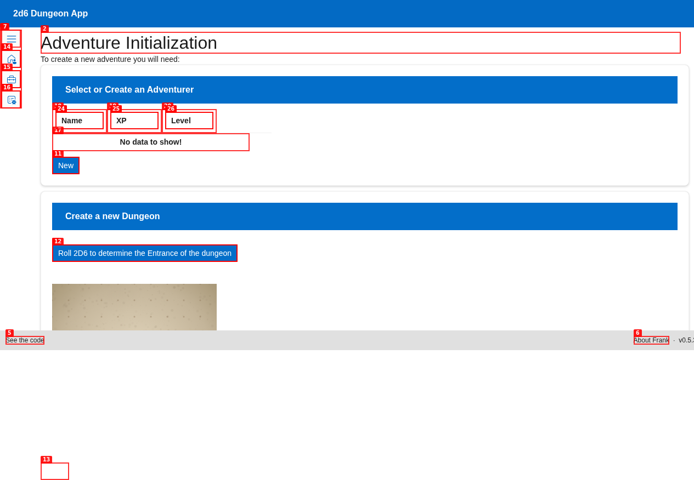

# Getting Started with the 2D6 Dungeon App 🚀

This guide walk you through how to run the **2D6 Dungeon App** companion application on your local machine using Docker. By the end of this guide, you will have the app up, a running local database, and your first adventure initialized!

---

## 🛠️ Requirements

Before starting, ensure you have the following installed on your system:
* [Docker Desktop](https://www.docker.com/products/docker-desktop/) or Docker Engine
* [Docker Compose](https://docs.docker.com/compose/)
* Git (to clone the repository)

---

## 📥 Step 1: Clone the Repository

Clone the repository to your local machine and navigate into the project directory:

```bash
git clone https://github.com/fboucher/2d6-dungeon-app.git
cd 2d6-dungeon-app
```

---

## ⚙️ Step 2: Configure your Environment (`.env`)

The application uses an environment file to manage database credentials and port configurations. Copy the provided `.env.example` file to create a `.env` file:

```bash
cp .env.example .env
```

Open the `.env` file in your preferred text editor and customize the values as needed. Here is a standard development setup:

```env
# Docker Hub namespace (username or org)
DOCKERHUB_NAMESPACE=fboucher
# Image tag to pull with compose; usually matches the git tag that published the images
IMAGE_TAG=latest

# Database settings
MYSQL_ROOT_PASSWORD=localdev123
MYSQL_DATABASE=db2d6
MYSQL_PORT=3306

# Data API Builder
DAB_PORT=5000

# Web app
WEBAPP_PORT=8080
ASPNETCORE_ENVIRONMENT=Production
```

---

## ⚡ Step 3: Spin Up the Containers

Start all 3 services (MySQL Database, Data API Builder, and Blazor Web App) in detached background mode:

```bash
docker compose up -d
```

### Checking Container Status:
You can verify that all 3 containers are healthy and running by executing:

```bash
docker compose ps
```

You should see three running services:
1. `2d6-dungeon-database-1` (MySQL DB)
2. `2d6-dungeon-dab-1` (Azure Data API Builder backend)
3. `2d6-dungeon-webapp-1` (Blazor Web App front-end)

---

## 🖥️ Step 4: Access the Companion App

Open your favorite web browser and navigate to:
👉 **[http://localhost:8080](http://localhost:8080)**

Once loaded, you should see the Welcome Home Page!

---

## 🗺️ Step 5: Creating Your First Adventure

To start your journey:
1. On the home page, click the prominent blue **`+ Create a new adventure`** button.
2. You will be redirected to the **Adventure Initialization** screen:



### The Adventure Setup Steps:
1. **Select or Create an Adventurer:**
   - In the "Select or Create an Adventurer" card, you'll see a list of your existing characters.
   - If you're playing for the first time, click **`New`** to build your first adventurer. (See [Creating Your Adventurer](Creating-Your-Adventurer) for a detailed walkthrough).
2. **Roll for the Dungeon Entrance:**
   - Once your adventurer is selected, roll 2D6 to determine the size and layout of the dungeon's **Entrance**.
   - Click **`Roll 2D6 to determine the Entrance of the dungeon`**.
   - The app will automatically roll and render the entrance grid on the screen's canvas!
3. **Embark!**
   - Click the green **`Start`** button to finalize creation and enter the dungeon!

---

## 🛑 Stopping the App

When you are done playing, you can safely shut down the containers to free up system resources:

```bash
docker compose down
```

Your campaign data is stored in a Docker volume, so your adventurers and map progress will be fully saved for your next session!
