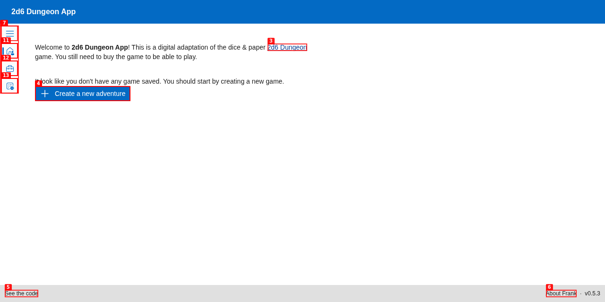
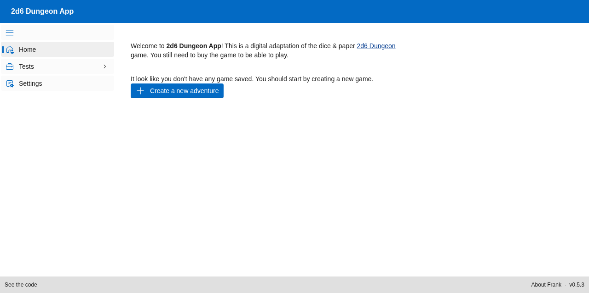

# Welcome to the 2D6 Dungeon Companion App Wiki! 🗡️🎲

Welcome to the official documentation for the **2D6 Dungeon App**—a complete digital companion and adaptation of the classic-style print-and-play solo dungeon crawler, **2D6 Dungeon**, designed by Toby Lancaster (DR Games).

This digital adaptation helps you automate the tedious bookkeeping, card/table references, and paper-tracking of your adventures so you can focus entirely on the exploration, tactical combat, and story!

---

## ⚠️ Important Companion App Disclaimer

This application is a **digital companion**. To play and fully experience the game, **you still need to purchase the official rulebooks and files**. 

* **Get the Game:** You can purchase the official rules, tables, and print-and-play materials directly from the [DR Games Itch.io Store](https://d-r-games.itch.io/2d6-dungeon-demo).
* **Respect the Creator:** This app does not replace the rulebook. Instead, it serves as a digital sheet, map constructor, and dice helper to streamline your sessions!

---

## 🖥️ The Home Screen

When you first launch the application, you'll be greeted by the clean, retro-styled **Home Page**. 

### Core Elements of the Home Page:
1. **Dynamic Welcome Message:** The app automatically scans your database to see if you have existing adventures.
   - **First Run:** If no saved games are detected, the app displays a helpful tip suggesting you begin by creating a new adventure.
   - **Returning Adventurers:** If you have active campaigns, the system detects them and displays options to either continue a saved game or start a fresh quest.
2. **Navigation Sidebar:** Toggle the sidebar (using the hamburger menu button in the top left) to access the core screens:
   - **Home:** Return to this launch page.
   - **Adventurers:** Create, view, and manage your hero sheets.
   - **Settings:** Configure game rules, database preferences, and UI options.

---

## 🗺️ Key Features Overview

* **🛡️ Hero Customization:** Build and save multiple adventurers. Choose weapons (like Longswords, Greataxes, Heavy Maces), select their starting combat manoeuvres, customize armour pieces, and track magic scrolls.
* **🧭 Dungeon Exploration:** Generate and map out dungeon rooms dynamically based on your 2D6 rolls. Construct pathways, place doors, and explore deeper into the unknown.
* **⚔️ Automated Combat Tracker:** Manage encounters with dungeon creatures. Log initiative, execute combat turns, track health (HP), and roll active combat manoeuvres seamlessly.
* **💾 Campaign Persistence:** Save and load your adventures. Your hero sheets, explored maps, and inventory are saved in a local database so you can pick up your quest exactly where you left off.

---

## 📖 Wiki Navigation Index

To dive deeper into specific systems and guides, follow the articles below:

1. **[Getting Started](Getting-Started)** — How to run the app locally using Docker, customize database properties, and launch your first campaign.
2. **[Creating Your Adventurer](Creating-Your-Adventurer)** — A step-by-step guide to rolling stats, selecting starting weapons, and training your manoeuvres.
3. **[Exploring the Dungeon](Exploring-the-Dungeon)** — Mastering the map viewer, room placement, door interactions, and dungeon exploration.
4. **[Combat System](Combat-System)** — Detailed breakdown of how to wage battles, resolve manoeuvres, and log turns.
5. **[Saving & Loading](Saving-and-Loading)** — Managing multiple adventurers and campaigns safely.
6. **[Settings](Settings)** — Customizing preferences, debugging logs, and developer options.
